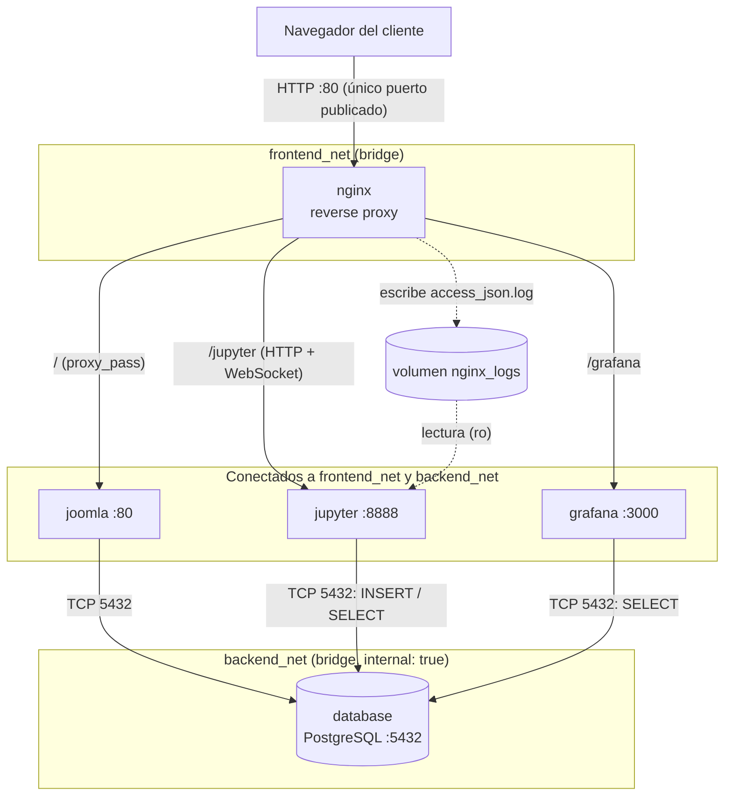
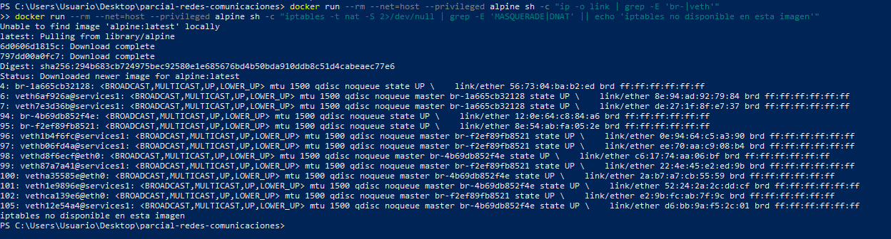
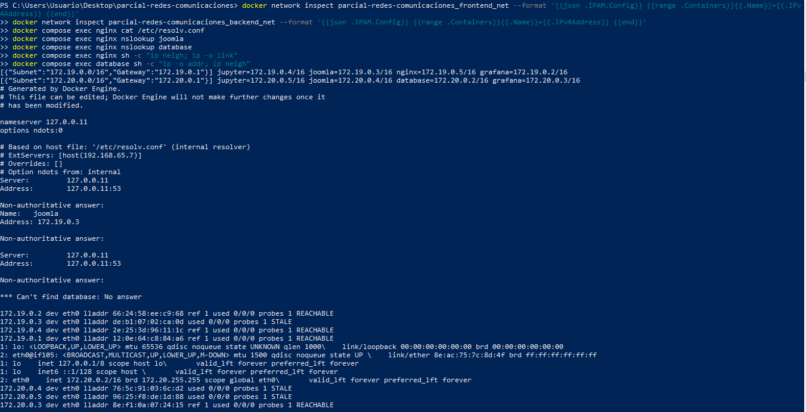

# Informe técnico: infraestructura multi-contenedor y análisis del modelo OSI

**Asignatura:** Comunicaciones, Ingeniería Mecatrónica
**Integrantes:** Jesús Daniel Chamorro Zamora, Luna Fernanda Scott Martinez
**Profesor:** Ing. Andrés Julián Moreno M.Sc.
**Fecha:** 2 de octubre de 2026

## Sección 1: Topología y flujo de información

### 1.1 Diagrama de arquitectura



### 1.2 Contenedores, redes y puertos

| Contenedor | Redes | Puerto interno | Publicado al host |
|---|---|---|---|
| nginx | frontend_net | 80 | **80:80** |
| joomla | frontend_net, backend_net | 80 | no |
| database | backend_net | 5432 | no |
| jupyter | frontend_net, backend_net | 8888 | no |
| grafana | frontend_net, backend_net | 3000 | no |

Decisiones de diseño:

- **Un solo puerto expuesto.** Todo el tráfico externo entra por nginx en el 80.
- **`backend_net` con `internal: true`.** Docker no crea ruta hacia el exterior ni publica puertos en esa red, por lo que `database` no tiene visibilidad externa.
- **Jupyter y Grafana también están en `backend_net`.** El enunciado define PostgreSQL como fuente consultable por ambos. Jupyter además ejecuta el proceso de ingesta que inserta los logs. Es una ampliación respecto a la topología mínima (que solo exige joomla, database y opcionalmente grafana) y se justifica por el flujo de datos de la sección 1.3.
- **Persistencia.** Volúmenes nombrados: `pgdata` (`/var/lib/postgresql/data`), `joomla_data` (`/var/www/html`), `grafana_data`, `nginx_logs`. Bind-mounts: cuaderno de Jupyter y provisioning de Grafana.
- **Sincronización.** `database` tiene healthcheck con `pg_isready`, y joomla, jupyter y grafana usan `depends_on` con `condition: service_healthy`, así Joomla no intenta instalarse antes de que PostgreSQL acepte conexiones.

### 1.3 Recolección de logs y métricas

Grafana no lee archivos de log directamente, por lo que los eventos de nginx se llevan a PostgreSQL:

1. **Generación.** nginx registra cada petición en `/var/log/nginx/access_json.log` con un `log_format` JSON (hora, IP, método, URI, código, bytes, tiempo de respuesta, user agent y el campo `service` que identifica a qué backend se enrutó).
2. **Compartición.** Ese archivo vive en el volumen nombrado `nginx_logs`, montado en lectura-escritura en nginx y en solo lectura en jupyter.
3. **Ingesta.** Al arrancar jupyter, un hook de `before-notebook.d` lanza `ingest_logs.py` en segundo plano. Crea la tabla `access_logs`, lee el archivo desde el inicio, sigue leyendo en vivo (cada segundo) e inserta cada línea.
4. **Consulta.** Grafana tiene aprovisionado un datasource PostgreSQL y el dashboard "Tráfico Joomla". Sus 4 paneles ejecutan SQL sobre `access_logs`: peticiones por minuto de Joomla, peticiones por código HTTP, IPs más recurrentes y peticiones por servicio.
5. **Análisis.** El cuaderno `analisis_datos.ipynb` consulta la misma tabla con SQLAlchemy y psycopg2 y grafica con pandas y matplotlib.

Limitación conocida: si se reinicia solo el contenedor jupyter, la ingesta relee el log desde el principio y duplica filas. No afecta el despliegue limpio (`up -d`).

### 1.4 Automatización del despliegue

- Grafana: acceso anónimo como Viewer y dashboard de inicio configurado, para no requerir login.
- Jupyter: sin token ni contraseña; `/jupyter` redirige al cuaderno.
- Un script (`warmup_and_run.py`) espera a que Joomla termine de instalarse, genera tráfico de calentamiento y ejecuta el cuaderno con `nbconvert`, de modo que se abre con las gráficas dibujadas.
- Sin token ni login, Jupyter y Grafana quedan abiertos para cualquiera con acceso al puerto 80. Es una decisión consciente para un entorno local de laboratorio y no debe replicarse en producción.

## Sección 2: Análisis detallado del modelo OSI en la solución

### 2.1 Capa 7 (Aplicación)

**Cabeceras HTTP que inyecta nginx.** Cada backend recibe la petición a través del proxy, por lo que pierde de vista al cliente real. nginx lo compensa con cabeceras:

| Cabecera | Valor | Rol |
|---|---|---|
| `Host` | `$http_host` | Conserva el host original (`localhost`). Sin ella el backend vería `jupyter:8888` o `grafana:3000`, generaría URLs incorrectas y Jupyter rechazaría el WebSocket por no coincidir con `Origin` |
| `X-Forwarded-For` | `$proxy_add_x_forwarded_for` | Cadena de IPs por las que pasó la petición, para registro y auditoría |
| `X-Forwarded-Proto` | `$scheme` | Esquema original (`http`/`https`), para que Joomla y Grafana construyan enlaces coherentes |
| `X-Real-IP` | `$remote_addr` | IP directa del cliente que llegó a nginx |

Observación del despliegue: la IP registrada en los logs es siempre `172.19.0.1`, la puerta de enlace del bridge. Docker Desktop en Windows hace NAT antes de entregar el paquete a nginx, por lo que la IP real del navegador no se conserva. En un host Linux nativo sí se vería la IP del cliente.

**Incidente real documentado.** Durante el desarrollo, los bloques `location /jupyter` y `/grafana` solo definían `Upgrade` y `Connection`. En nginx, un `location` que declara cualquier `proxy_set_header` ignora los definidos en el nivel `server`, así que se perdió `Host`. Jupyter comparó `Host: jupyter:8888` con `Origin: http://localhost`, rechazó el handshake (403) y el kernel quedó *Disconnected*. El dashboard de Grafana llegó a registrar más de cien respuestas 403 de ese periodo. Al repetir todas las cabeceras en cada `location`, el kernel conectó.

**HTTP Upgrade para WebSockets.** El kernel de Jupyter se comunica por WebSocket. El cliente envía una petición HTTP/1.1 con `Upgrade: websocket` y `Connection: Upgrade`; el servidor responde `101 Switching Protocols` y la misma conexión TCP pasa a transportar tramas bidireccionales. Como `Upgrade` y `Connection` son cabeceras *hop-by-hop*, nginx no las reenvía por defecto; se configuran explícitamente:

```nginx
proxy_http_version 1.1;
proxy_set_header Upgrade $http_upgrade;
proxy_set_header Connection $connection_upgrade;   # map: upgrade si hay Upgrade, close si no
proxy_read_timeout 86400;                          # no cortar sesiones inactivas
```

La evidencia son los registros con código `101` que aparecen en el dashboard al abrir el cuaderno.

**Protocolo cliente/servidor de PostgreSQL.** Joomla (driver pgsql), Grafana, `psycopg2` y SQLAlchemy usan el protocolo de mensajes de PostgreSQL sobre TCP: el cliente envía un *StartupMessage* (usuario y base), el servidor solicita autenticación (SCRAM-SHA-256 en PostgreSQL 16), y luego se intercambian mensajes tipados (`Query`, `RowDescription`, `DataRow`, `CommandComplete`, `ReadyForQuery`). Es un protocolo binario propio, no HTTP.

**Formato de logs.** Apache de Joomla escribe en formato *combined* (`IP - - [fecha] "GET /ruta HTTP/1.1" 200 bytes "referer" "user-agent"`). Para el análisis, nginx escribe un registro propio en JSON, un objeto por línea:

```json
{"time":"2026-10-02T05:13:23+00:00","remote_addr":"172.19.0.1","method":"GET","uri":"/","status":200,"bytes":2346,"request_time":0.796,"referer":"","user_agent":"Mozilla/5.0 ...","service":"joomla"}
```

El formato JSON evita expresiones regulares frágiles al parsear, y el campo `service` permite filtrar por backend.

### 2.2 Capa 4 (Transporte)

| Servicio | Puerto TCP | Alcance |
|---|---|---|
| nginx | 80 | Publicado al host (`80:80`) |
| joomla (Apache) | 80 | Solo red interna |
| jupyter | 8888 | Solo red interna |
| grafana | 3000 | Solo red interna |
| PostgreSQL | 5432 | Solo `backend_net` |

Todo el tráfico de la solución usa TCP, pues HTTP, WebSocket y el protocolo de PostgreSQL requieren entrega ordenada y confiable. UDP solo aparece en la consulta DNS al resolver embebido (puerto 53).

**Conexiones concurrentes y persistentes.**

- **Cliente a nginx.** El navegador abre varias conexiones TCP simultáneas (cada una con su puerto efímero de origen) para descargar CSS, JS e imágenes de Joomla en paralelo. nginx las atiende con `keepalive` y las reutiliza entre peticiones.
- **nginx a backends.** nginx solo reutiliza conexiones hacia el backend si se configura un `upstream` con `keepalive`. En este laboratorio no se configuró porque la carga es baja, así que cada petición proxeada abre una conexión TCP nueva al backend.
- **WebSocket.** Es una conexión TCP de larga duración; por eso `proxy_read_timeout 86400`, para que nginx no la cierre por inactividad.
- **CMS a PostgreSQL.** Joomla se conecta al puerto 5432 desde PHP. Por defecto PHP no mantiene un pool entre peticiones, por lo que lo habitual es una conexión por petición, con handshake TCP de tres vías, autenticación SCRAM y cierre (comportamiento típico de PHP, no medido en este despliegue). En cambio, el proceso de ingesta de Jupyter mantiene **una conexión persistente** durante toda su vida (con reconexión automática si cae), y Grafana mantiene un pool de conexiones propio. El *connection pooling* de SQLAlchemy se aplica al cuaderno.
- **Keep-alive TCP.** El kernel Linux puede enviar sondeos `SO_KEEPALIVE` en conexiones inactivas para detectar pares caídos. La ingesta depende de su lógica de reconexión para sobrevivir a cortes.

### 2.3 Capa 3 (Red)

**Direccionamiento (evidencia del despliegue).**

| Red | Subred | Gateway | Miembros |
|---|---|---|---|
| frontend_net | 172.19.0.0/16 | 172.19.0.1 | grafana .2, joomla .3, jupyter .4, nginx .5 |
| backend_net | 172.20.0.0/16 | 172.20.0.1 | database .2, grafana .3, joomla .4, jupyter .5 |

Joomla, Jupyter y Grafana tienen **dos interfaces** (una por red), por lo que son multi-homed. `database` solo tiene una, en `backend_net`. Las subredes son distintas, de modo que entre redes solo hay comunicación a través de un contenedor que pertenezca a ambas.

**Aislamiento.**

- `nginx` no está en `backend_net`: desde nginx, `nslookup database` falla con `Can't find database: No answer`, y no existe ruta IP hacia 172.20.0.0/16.
- `backend_net` se creó con `internal: true` (verificado con `docker network inspect ... --format '{{.Internal}}'`, que devuelve `true`): Docker no instala reglas de salida ni de publicación de puertos, así que `database` no alcanza el exterior ni es alcanzable desde él.
- La única vía a PostgreSQL es desde los tres contenedores que pertenecen a `backend_net`.

**DNS embebido de Docker (127.0.0.11).** Cada contenedor en una red definida por el usuario recibe un `/etc/resolv.conf` con `nameserver 127.0.0.11`. Docker intercepta las consultas a esa dirección y las responde con un resolver interno que conoce los nombres de servicio de las redes del contenedor que consulta. Por eso `joomla` resuelve a `172.19.0.3` desde nginx, y `database` solo resuelve para los miembros de `backend_net`: la respuesta depende de en qué redes esté quien pregunta. Lo que no es un nombre de contenedor se reenvía al DNS del host (`ExtServers: [host(192.168.65.7)]` en Docker Desktop).

Como nginx resuelve los nombres en tiempo de ejecución (variables en `proxy_pass` más `resolver 127.0.0.11 valid=10s`), no falla al arrancar si un backend todavía no existe y se adapta si un contenedor cambia de IP.

**Reenvío y NAT en el host.** Reglas capturadas en la tabla `nat` del kernel del host (en Docker Desktop, la VM Linux de WSL2) con `iptables -t nat -S`:

```
-A DOCKER -p tcp -m tcp --dport 80 -j DNAT --to-destination 172.19.0.5:80
-A POSTROUTING -s 172.19.0.0/16 ! -o br-4b69db852f4e -j MASQUERADE
-A POSTROUTING -s 172.19.0.5/32 -d 172.19.0.5/32 -p tcp -m tcp --dport 80 -j MASQUERADE
```

- **Publicación del puerto 80 (DNAT).** La regla de la cadena `DOCKER` traduce el destino de cualquier paquete TCP al puerto 80 del host hacia `172.19.0.5:80`, que es nginx. Por eso nginx es el único servicio alcanzable desde fuera.
- **Salida a Internet (MASQUERADE).** Los paquetes de `172.19.0.0/16` (frontend_net) que salen por una interfaz distinta de `br-4b69db852f4e` cambian su IP de origen por la del host.
- **backend_net sin NAT.** Al crearla con `internal: true`, Docker no instala ninguna regla para `172.20.0.0/16` ni para `br-f2ef89fb8521`: no aparece ni DNAT ni MASQUERADE. Esto confirma el aislamiento observado con `nslookup`.
- **Hairpin NAT.** La tercera regla enmascara el tráfico de nginx hacia sí mismo a través del puerto publicado.
- **Reenvío.** El kernel enruta entre el puente y el exterior con `net.ipv4.ip_forward=1` y reglas de la cadena `FORWARD` (mecanismo estándar de Docker, no capturado en este entorno).
- **Efecto observado.** Como el tráfico entrante pasa por NAT en Docker Desktop, nginx registra siempre como origen la IP del gateway `172.19.0.1`.
- En la salida completa aparecen también reglas de `docker0` (172.17.0.0/16) y `br-1a665cb32128` (172.18.0.0/16), que corresponden a otros contenedores del equipo y no a esta solución.

### 2.4 Capa 2 (Enlace de datos)

**veth y bridges.** Por cada red Docker crea un puente Linux virtual (`br-<id>`) que actúa como switch de capa 2. Por cada interfaz de contenedor crea un par `veth`: un extremo queda dentro del contenedor como `eth0` y el otro en el host, conectado al puente. Un contenedor con dos redes (joomla) tiene dos pares veth y dos puentes distintos.

Evidencia tomada en el host (en Docker Desktop, la VM Linux de WSL2) con `ip -o link`:



| Puente | Red | Interfaces veth (índice) | Contenedores |
|---|---|---|---|
| `br-4b69db852f4e` | frontend_net | 98, 100, 101, 105 | grafana, joomla, jupyter, nginx |
| `br-f2ef89fb8521` | backend_net | 96, 97, 99, 102 | database, grafana, joomla, jupyter |

Los identificadores de puente se confirmaron con `docker network ls --no-trunc`: los 12 primeros caracteres del ID de cada red forman el nombre del puente.

Verificaciones cruzadas:

- La MAC del puente `br-4b69db852f4e` es `12:0e:64:c8:84:a6`, idéntica a la de la puerta de enlace `172.19.0.1` en la tabla ARP de nginx. El gateway de la subred es el propio puente.
- nginx muestra `eth0@if105`; la interfaz 105 del host es `veth12e54a4`, con `master br-4b69db852f4e`. Es la otra mitad de su par veth.
- Cada puente tiene tantos veth como miembros tiene su red (4 y 4), y joomla, jupyter y grafana aparecen en ambos puentes.
- Los veth 6 y 7 (`br-1a665cb32128`) pertenecen a otra red Docker del equipo y no forman parte de esta solución.

El puente aprende las direcciones MAC de origen y reenvía cada trama solo por el puerto que corresponde, como un switch físico.

**ARP interno.** Dentro de una misma subred, un contenedor que quiere enviar a otro necesita su MAC. Envía un `ARP who-has 172.19.0.3` por *broadcast* al puente, y el contenedor dueño de esa IP responde con su MAC. Evidencia en la tabla de vecinos de nginx:



```
172.19.0.2 dev eth0 lladdr 66:24:58:ee:c9:68 REACHABLE   (grafana)
172.19.0.3 dev eth0 lladdr de:b1:07:02:ca:0d STALE       (joomla)
172.19.0.4 dev eth0 lladdr 2e:25:3d:96:11:1c REACHABLE   (jupyter)
172.19.0.1 dev eth0 lladdr 12:0e:64:c8:84:a6 REACHABLE   (gateway = br-4b69db852f4e)
```

En `database`, la tabla solo contiene vecinos de `backend_net` (172.20.0.3, .4 y .5). Las entradas pasan de `REACHABLE` a `STALE` cuando caduca su confirmación y se revalidan con un nuevo ARP en el siguiente uso. Como nginx y database están en bridges distintos, **nunca intercambian ARP**: son dominios de broadcast separados, lo que refuerza el aislamiento observado en Capa 3.

## Sección 3: Guía de verificación y demostración

Todo parte de un entorno limpio:

```bash
git clone <URL_DEL_REPOSITORIO>
cd <CARPETA_DEL_REPOSITORIO>
cp .env.example .env
docker compose up -d
docker compose ps        # esperar a que los 5 estén (healthy)
```

### 3.1 Abrir Joomla a través de nginx y generar tráfico

1. Abrir http://localhost y navegar por el sitio, recargando varias veces.
2. Para generar más tráfico, incluidos errores 404:

```bash
for i in $(seq 1 20); do curl -s -o /dev/null http://localhost/; curl -s -o /dev/null http://localhost/no-existe; done
```

(En PowerShell: `1..20 | % { curl.exe -s -o NUL http://localhost/ ; curl.exe -s -o NUL http://localhost/no-existe }`)

### 3.2 Constatar los datos en Grafana

1. Abrir http://localhost/grafana. Carga directo el dashboard "Tráfico Joomla" (se refresca cada 10 s).
2. Comprobar que "Peticiones por código HTTP" sube en 20 para el 404 tras el paso anterior.
3. Contrastar con la base de datos:

```bash
docker compose exec database psql -U joomla -d joomla -c "SELECT status, count(*) FROM access_logs GROUP BY 1 ORDER BY 1;"
```

4. Contrastar la ingesta contra el log crudo (los números deben coincidir o diferir en pocas líneas recientes):

```bash
docker compose exec nginx sh -c "wc -l /var/log/nginx/access_json.log"
docker compose exec database psql -U joomla -d joomla -c "SELECT count(*) FROM access_logs;"
```

### 3.3 Cuaderno de Jupyter

1. Abrir http://localhost/jupyter. Se abre `analisis_datos.ipynb` sin token, ya ejecutado.
2. Para re-ejecutar: **Run → Run All Cells**. El indicador del kernel debe quedar en *Idle*, lo que confirma que el WebSocket funciona a través de nginx.
3. Resultado esperado: número de peticiones cargadas desde PostgreSQL, gráfico por código HTTP, torta por servicio, IPs más frecuentes y serie temporal por minuto.

### 3.4 Verificación de la segmentación de red

```bash
docker network inspect parcial-redes-comunicaciones_backend_net --format '{{.Internal}}'
docker compose ps        # solo nginx muestra un puerto publicado (0.0.0.0:80->80)
```

El primer comando debe imprimir `true`.